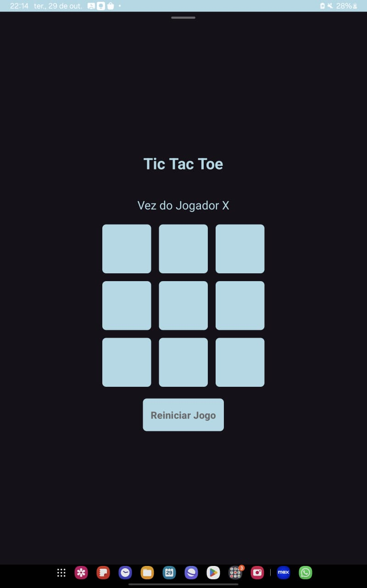

<h1 align="center">Jogo Da Velha</h1>

## Project
This project consists of an Android application that implements a basic Tic-Tac-Toe game. The application allows users to play the classic Tic-Tac-Toe game against another player. With a simple and intuitive interface, users can easily mark their moves on the board and see the game's progress in real-time. The application also includes basic functionality to check for win conditions and reset the game.

## Layout
<div align="center">
  
</div>

## Technologies Used
- **Programming Language:** Kotlin
- **Development Environment:** Android Studio

## Code Author
```kotlin
fun main() {
    println("Code by Gabriela Oliveira!")
}
